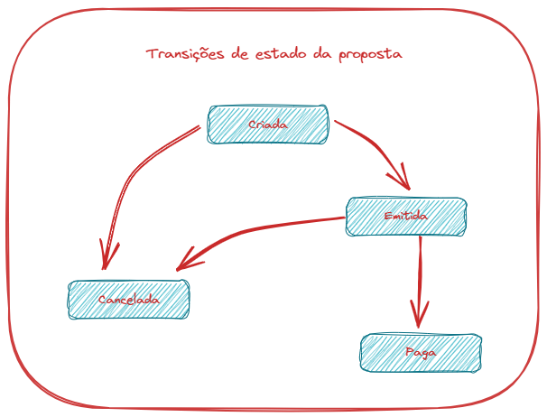

# 🚀 Desafio Enconta

---

Para avaliar a sua capacidade técnica, propomos um cenário e 
gostaríamos que você resolvesse o desafio utilizando suas habilidades.

Não há o  certo nem o errado. Estruture a solução como você julgar mais adequado.
Utilize comentários no código ou qualquer outro artifício para ajudar na
no entendimento da sua solução.

## Cenário

---

A Enconta oferece produtos financeiros, sendo que um deles é o crédito pessoal.
Para isso, devemos emitir propostas de crédito em uma instituição financeira.

Nosso objetivo é criar uma solução que ofereça as seguintes funcionalidades:

* Criação de uma nova proposta
* Emissão da proposta na instituição financeira
* Cancelamento de uma proposta
* Registro do pagamento de uma proposta pela instituição financeira

Suponha que uma proposta possui as seguinte propriedades (além de quaisquer outras
que você julgar necessárias):

* CPF do emitente
* Código (GUID)
* Situação da proposta (criada, emitida, cancelada ou paga)
* Valor do empréstimo
* Taxa de juros
* Quantidade de parcelas
* Histórico com a data a situação da proposta

Considere que instituição financeira disponibilize uma API para a 
emissão da propostas e que nos envie uma notificação quando uma proposta
for paga.

As transições de estado válidas são as ilustradas na figura a seguir:

## O que você deve fazer?

---

Desenvolva uma solução em plataforma **.NET Core** ou **.NET 5** que implemente as funcionalidades
apresentadas. Você pode criar uma aplicação console, API, _class library_ ou até mesmo somente
testes unitários.

Não é necessário 
* Criar mecanismos de persistência de dados
* Criar um _frontend_

## O que iremos avaliar?

---

* Capacidade de abstração e resolução de problemas
* Conceitos de programação orientada a objetos e _design patterns_
* Conceitos de Domain Driven Design
* Conceitos de arquitetura de software
* Densenvolvimento de aplicações em camadas

### 😎 Boa sorte!